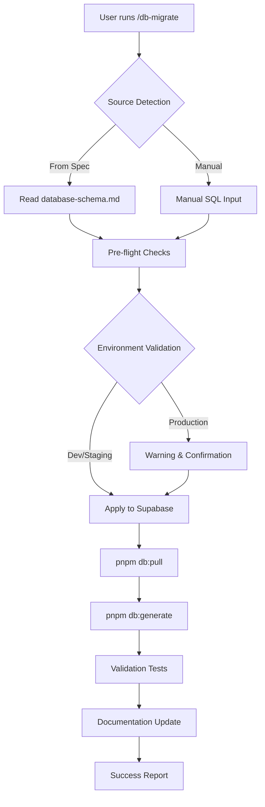

# DB Migrate - Database Migration Orchestrator

## Description
Automated database migration command that orchestrates the complete Supabase-first migration workflow, from schema changes through TypeScript type generation and validation.

## Usage
```
/db-migrate [options]
```

## Options

### HIL (Human-in-the-Loop) Controls
- `--preview` - **DEFAULT**: Show detailed migration plan without execution
- `--approve-migration` - Interactive approval mode for applying changes
- `--plan-only` - Generate comprehensive migration plan with risk assessment
- `--confirm` - Required flag for production environment changes

### Migration Operations
- `--from-feature` - Auto-detect changes from active feature's database-schema.md
- `--validate` - Validation-only mode (dry-run without applying changes) 
- `--env [dev|staging|prod]` - Target specific environment (default: dev)
- `--sync` - Sync schema across all environments
- `--generate-only` - Only pull schema and generate TypeScript types
- `--status` - Check current migration status and schema sync

### Rollback Operations  
- `--rollback-plan` - Generate rollback procedures for recent changes (no execution)
- `--rollback-history` - Show migration history with rollback options

@include shared/hil-patterns.yml#HIL_Framework

## Implementation

### HIL Integration

**Risk Assessment**: Schema changes (HIGH), Data migrations (CRITICAL), Index operations (MEDIUM)
**Default Mode**: Preview-only with comprehensive impact analysis
**Production Requirements**: APPROVE level with manual confirmation
**Emergency Override**: Disabled for database operations (data integrity priority)

### Migration Preview and Planning

#### **Migration Impact Analysis**
```typescript
interface MigrationPlan {
  operations: MigrationOperation[];
  riskAssessment: RiskAssessment;
  rollbackPlan: RollbackPlan;
  estimatedDuration: string;
  impactScope: ImpactScope;
  prerequisites: string[];
  validationSteps: string[];
}

interface MigrationOperation {
  type: 'CREATE' | 'ALTER' | 'DROP' | 'INDEX' | 'CONSTRAINT';
  target: string;
  sql: string;
  riskLevel: 'LOW' | 'MEDIUM' | 'HIGH' | 'CRITICAL';
  reversible: boolean;
  dataImpact: boolean;
  lockingBehavior: 'none' | 'brief' | 'exclusive';
}

interface RiskAssessment {
  overallRisk: number;  // 0-100
  breakingChanges: boolean;
  dataLoss: boolean;
  downtime: boolean;
  rollbackComplexity: 'simple' | 'complex' | 'dangerous';
}
```

### Core Migration Process

1. **Migration Source Detection**
   - Automatically detect active feature with database-schema.md
   - Parse SQL changes and migration requirements
   - Validate against Supabase architecture standards
   - Generate preliminary impact assessment

2. **Migration Plan Generation** (Default Mode)
   - Analyze all proposed database changes
   - Calculate risk scores for each operation
   - Generate detailed rollback plan
   - Estimate execution time and impact scope
   - **STOP HERE** - Present plan to user for approval

3. **Pre-flight Safety Checks** (If Approved)
   - Confirm target environment and risk acceptance
   - Verify database connectivity and backup status
   - Check for pending migrations and conflicts
   - Validate prerequisites and dependencies

4. **Risk-Based Execution Control**
   - **Development**: Execute with monitoring
   - **Staging**: Execute with validation checkpoints  
   - **Production**: Require `--confirm` flag and APPROVE level

5. **Schema Application (Supabase-First)**
   - Execute SQL changes in controlled sequence
   - Monitor for migration conflicts and failures
   - Apply indexes, constraints, and relationships with validation
   - Implement rollback triggers for critical failures

6. **Local Schema Synchronization**
   - Run `pnpm db:pull` to update Prisma schema
   - Generate TypeScript types via `pnpm db:generate`
   - Validate type generation and compilation success
   - Check for breaking changes in application code

7. **Post-Migration Validation**
   - Run comprehensive connectivity and data integrity tests
   - Validate new types in application context
   - Generate migration success report with metrics
   - Update migration history with rollback procedures

### Migration Workflow Integration



### Output Format

```
🗄️ Database Migration Manager
================================

📍 TARGET ENVIRONMENT
┌─────────────┬─────────────────────────────────┬─────────────┐
│ Environment │ Database URL                    │ Status      │
├─────────────┼─────────────────────────────────┼─────────────┤
│ Development │ db.lmnpveudnonakxbrawlu...     │ 🟢 Active   │
└─────────────┴─────────────────────────────────┴─────────────┘

📋 MIGRATION SOURCE
Source: .agaile-os/features/2025-09-04-feature-name/sub-specs/database-schema.md
Type: Automatic detection from active feature

🔍 MIGRATION IMPACT ANALYSIS

**Risk Assessment:** MEDIUM (45/100) - Requires approval for execution

┌─────────────┬──────────────────────────────────┬─────────┬──────────┬─────────────┐
│ Type        │ Change Description               │ Impact  │ Risk     │ Reversible  │
├─────────────┼──────────────────────────────────┼─────────┼──────────┼─────────────┤
│ New Table   │ CREATE TABLE "Notification"      │ Medium  │ Low      │ ✅ Simple   │
│ New Column  │ ALTER TABLE "User" ADD lastAct.. │ Low     │ None     │ ✅ Simple   │
│ New Index   │ CREATE INDEX idx_notification..  │ None    │ None     │ ✅ Simple   │
│ Foreign Key │ ADD CONSTRAINT FK_notification..  │ Medium  │ Low      │ ⚠️ Complex  │
└─────────────┴──────────────────────────────────┴─────────┴──────────┴─────────────┘

🛡️ SAFETY ANALYSIS
✅ Database connection verified
✅ No conflicting pending migrations  
✅ Schema backup available
⚠️  Breaking changes detected: Foreign key constraint may fail on existing data
⚠️  Manual rollback required for constraint operations

📋 ROLLBACK PLAN
1. **Manual Steps Required** (Supabase Dashboard):
   └─ DROP CONSTRAINT FK_notification_user_id (if constraint creation fails)
   └─ DROP INDEX idx_notification_user_id  
   └─ DROP TABLE "Notification"
   
2. **Local Cleanup**:
   └─ Revert Prisma schema changes
   └─ Regenerate types: `pnpm db:generate`
   
**Estimated Rollback Time:** 5-10 minutes

⚠️  **APPROVAL REQUIRED** - Migration execution halted

**Execution Options:**

1️⃣  **Approve Migration** (Recommended for Development)
   └─ Command: `/db-migrate --approve-migration --from-feature`
   └─ Will execute all operations with monitoring and validation
   └─ Includes automatic rollback on critical failures

2️⃣  **Execute Specific Operations**
   └─ Command: `/db-migrate --approve-migration --operations="table,column,index"`
   └─ Skip risky constraint operations for manual execution
   
3️⃣  **Production Migration** (Staging/Production)
   └─ Command: `/db-migrate --approve-migration --env prod --confirm`
   └─ Requires APPROVE level confirmation and manual validation

4️⃣  **Generate Types Only** (Safe)
   └─ Command: `/db-migrate --generate-only`
   └─ Pull existing schema and regenerate types without changes

**⚠️ IMPORTANT NOTES:**
• This is a **PREVIEW ONLY** - no changes have been applied
• Database remains unchanged until explicit approval
• For production environments, consider staging validation first
• Manual database rollback procedures documented above

**Next Steps:**
• Review rollback plan and ensure familiarity with procedures
• Consider testing in staging environment first
• Use `--approve-migration` flag to proceed with execution
• Monitor application functionality after changes

```

### Environment-Specific Operations

#### Development Environment
```bash
# Standard development migration
/db-migrate --from-feature

# Generate types only (when schema manually changed)
/db-migrate --generate-only

# Validation without changes
/db-migrate --validate
```

#### Staging/Production Environment
```bash
# Staging migration with confirmation
/db-migrate --env staging --from-spec

# Production migration (requires extra confirmation)
/db-migrate --env prod --from-spec

# Cross-environment sync check
/db-migrate --sync --validate
```

### Error Handling & Recovery

#### Common Issues and Solutions

| Issue | Cause | Solution |
|-------|-------|----------|
| Connection timeout | Database unreachable | Check VPN, credentials, network |
| Schema pull fails | Prisma configuration issue | Verify DATABASE_URL, regenerate client |
| Type generation errors | Schema inconsistencies | Fix conflicts in Supabase, retry pull |
| Migration conflicts | Concurrent changes | Resolve in Supabase, sync schema |

#### Rollback Procedures

```bash
# Display rollback information
/db-migrate --rollback

# Manual rollback steps:
# 1. Revert changes in Supabase dashboard
# 2. Pull reverted schema: pnpm db:pull
# 3. Regenerate types: pnpm db:generate  
# 4. Commit rollback: git commit -m "revert(db): rollback [description]"
```

### Integration with HIL Workflow

#### Feature Integration
- Reads from `.agaile-os/features/*/sub-specs/database-schema.md`
- Parses SQL statements and migration requirements
- Validates against technical specifications
- Updates feature status upon completion

#### Command Chain Integration
```
/create-feature → /create-tasks → /execute-tasks → /db-migrate → /typescripter → /g
```

#### Quality Gates
- Pre-migration: Schema validation and safety checks
- Post-migration: Type generation and compilation verification  
- Integration: Automatic triggering of `/typescripter` for validation

### Advanced Features

#### Automated Migration Detection
- Monitors active features for database-schema.md files
- Detects when `/execute-tasks` generates database changes
- Provides smart suggestions for migration timing

#### Multi-Environment Synchronization
- Compare schemas across development, staging, production
- Detect schema drift and synchronization issues
- Provide commands for environment-specific migrations

#### Migration History Tracking
- Maintain log of all migrations with timestamps
- Track schema evolution over time
- Provide rollback reference for recent changes

#### Performance Monitoring
- Measure migration execution time
- Track type generation performance
- Monitor database connection health

#### Smart Validation
- Pre-validate SQL syntax before execution
- Check for potential breaking changes
- Verify foreign key constraints and relationships
- Detect potential data loss scenarios

### Security Considerations

- Environment confirmation for production changes
- Backup verification before major migrations  
- Credential validation and secure connection handling
- Change logging for audit compliance
- Rollback procedure documentation for incident response

This command serves as the central orchestrator for all database operations in the your project AI platform, ensuring consistent, safe, and documented migrations across all environments while maintaining the Supabase-first architecture principles.