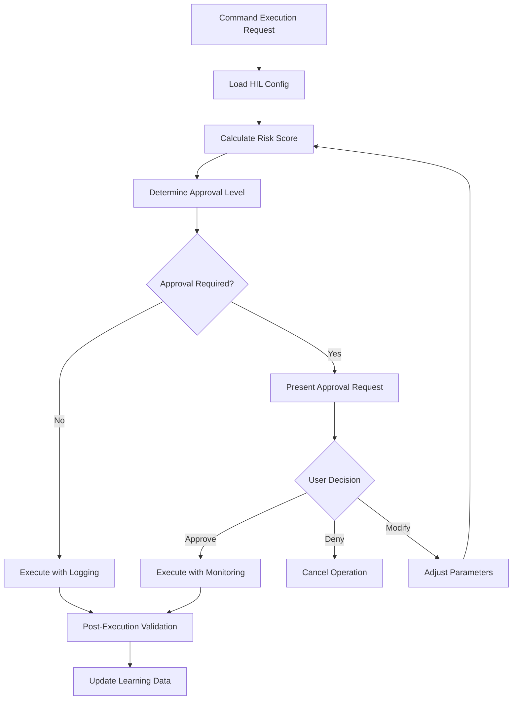

# HIL Approval Service - Implementation Guide

## Overview

The HIL (Human-in-the-Loop) Approval Service provides a standardized framework for implementing user approval workflows in command operations. This service transforms autonomous command execution into transparent, controllable processes with appropriate human oversight.

## Core Concepts

### Approval Workflow Engine

The approval engine evaluates operations based on:
- **Risk Assessment**: Calculated from operation type, environment, and impact scope
- **Confidence Scoring**: Based on pattern matching and success probability
- **Environment Context**: Development, staging, or production constraints
- **User Preferences**: Configurable approval thresholds

### Decision Flow



## Implementation Patterns

### 1. Risk Assessment Implementation

```typescript
interface RiskAssessment {
  baseRisk: 'LOW' | 'MEDIUM' | 'HIGH' | 'CRITICAL';
  environmentMultiplier: number;
  operationFactors: RiskFactor[];
  calculatedScore: number;
  recommendedApproval: ApprovalLevel;
}

interface RiskFactor {
  factor: string;
  impact: number;
  reasoning: string;
}

class HILRiskCalculator {
  calculateRisk(operation: Operation, environment: Environment): RiskAssessment {
    const baseScore = this.getBaseRiskScore(operation.type);
    const envMultiplier = this.getEnvironmentMultiplier(environment);
    const operationFactors = this.evaluateOperationFactors(operation);
    
    const calculatedScore = Math.min(100, 
      baseScore * envMultiplier + 
      operationFactors.reduce((sum, f) => sum + f.impact, 0)
    );
    
    return {
      baseRisk: this.getRiskCategory(baseScore),
      environmentMultiplier: envMultiplier,
      operationFactors,
      calculatedScore,
      recommendedApproval: this.getApprovalLevel(calculatedScore)
    };
  }
}
```

### 2. Confidence Scoring Implementation

```typescript
interface ConfidenceAssessment {
  patternMatchConfidence: number;
  strategyConfidence: number;
  successProbability: number;
  overallConfidence: number;
  requiresApproval: boolean;
}

class ConfidenceEvaluator {
  evaluateConfidence(operation: Operation, context: ExecutionContext): ConfidenceAssessment {
    const patternMatch = this.evaluatePatternMatching(operation.patterns);
    const strategy = this.evaluateStrategy(operation.strategy);
    const success = this.evaluateSuccessProbability(operation, context);
    
    const overall = (patternMatch + strategy + success) / 3;
    
    return {
      patternMatchConfidence: patternMatch,
      strategyConfidence: strategy,
      successProbability: success,
      overallConfidence: overall,
      requiresApproval: overall < HIL_CONFIG.confidenceThreshold
    };
  }
}
```

### 3. User Interaction Patterns

#### Confirmation Pattern
```bash
🔍 **TypeScript Error Resolution** - Risk Level: MEDIUM (45/100)

**Proposed Actions:**
1. Clear Next.js cache (.next/cache)
2. Reinstall dependencies (pnpm install)
3. Regenerate database types (pnpm db:generate)
4. Run build verification

**Estimated Impact:**
- Duration: 2-4 minutes
- Scope: Local development environment
- Reversibility: Fully reversible

**Confidence:** 87% (High confidence in strategy)

**Proceed?** [y/N/details/plan]
> 
```

#### Approval Pattern
```bash
⚠️  **APPROVAL REQUIRED** - Production Database Migration

**Risk Assessment:**
- Risk Level: HIGH (78/100)
- Environment: Production
- Impact Scope: All users, core database schema

**Detailed Plan:**
Phase 1: Create new "Notification" table
  └─ SQL: CREATE TABLE "Notification" (...)
  └─ Risk: Low (additive change)
  
Phase 2: Add foreign key constraint
  └─ SQL: ALTER TABLE "User" ADD CONSTRAINT FK_notification...
  └─ Risk: Medium (constraint could fail on existing data)
  
Phase 3: Update TypeScript types
  └─ Command: pnpm db:generate
  └─ Risk: Low (type generation)

**Rollback Strategy:**
- Manual: Drop table and constraint in Supabase
- Code: Revert Prisma schema and regenerate types
- Estimated rollback time: 5-10 minutes

**Pre-conditions:**
✅ Database backup created
✅ Staging migration successful
✅ Type safety validated

**Approval Required:** [approve/deny/modify/defer]
> 
```

### 4. Progress Monitoring Implementation

```typescript
interface ProgressMonitor {
  operationId: string;
  totalPhases: number;
  currentPhase: number;
  completedSteps: string[];
  currentStep: string;
  remainingSteps: string[];
  allowUserControl: boolean;
}

class HILProgressTracker {
  async executeWithMonitoring(operation: Operation, approval: Approval): Promise<ExecutionResult> {
    const monitor = this.createProgressMonitor(operation);
    
    for (const phase of operation.phases) {
      monitor.currentPhase++;
      monitor.currentStep = phase.name;
      
      await this.displayProgress(monitor);
      
      if (monitor.allowUserControl) {
        const userChoice = await this.promptUserControl();
        if (userChoice === 'abort') {
          return this.handleAbort(operation, monitor);
        }
        if (userChoice === 'pause') {
          await this.handlePause();
        }
      }
      
      const phaseResult = await this.executePhase(phase);
      
      if (!phaseResult.success) {
        return this.handlePhaseFailure(phase, phaseResult, monitor);
      }
      
      monitor.completedSteps.push(phase.name);
    }
    
    return this.completeExecution(operation, monitor);
  }
}
```

## Command Integration Guide

### Adding HIL to Existing Commands

#### Step 1: Import HIL Framework
```markdown
# In your command.md file
@include shared/hil-patterns.yml#HIL_Framework

# Add HIL evaluation
@block hil_evaluation
- Load HIL configuration for command type
- Calculate risk assessment based on operation
- Determine approval level required
- Present appropriate user interface
```

#### Step 2: Implement Risk Assessment
```typescript
// In command implementation
const hilAssessment = await HILService.evaluateOperation({
  type: 'database_migration',
  environment: process.env.NODE_ENV,
  scope: operation.scope,
  reversibility: operation.reversible,
  confidence: confidence.overall
});
```

#### Step 3: Handle Approval Flow
```typescript
if (hilAssessment.requiresApproval) {
  const approval = await HILService.requestApproval({
    operation,
    riskAssessment: hilAssessment,
    executionPlan: operation.phases,
    rollbackPlan: operation.rollbackStrategy
  });
  
  if (!approval.granted) {
    return HILService.handleRejection(approval);
  }
}
```

## Configuration Integration

### Command-Specific HIL Settings

Each command can override default HIL behavior:

```yaml
# In command implementation
command_hil_config:
  typescripter:
    default_approval: "CONFIRM"
    confidence_threshold: 70
    allow_auto_execute: true
    phase_checkpoints: true
    
  ci_cd:
    rollback_approval: "APPROVE"
    production_multiplier: 2.0
    emergency_override: false
    
  fixer:
    nuclear_option_approval: "APPROVE"
    pattern_confidence_threshold: 60
    explain_reasoning: required
```

### User Preference Integration

Users can configure their HIL preferences:

```yaml
# .claude/hil-config.yml
user_preferences:
  default_approval_level: "CONFIRM"
  risk_tolerance: "medium"
  show_confidence_scores: true
  require_rollback_plans: true
  
environment_overrides:
  production:
    approval_level: "APPROVE"
    risk_tolerance: "low"
    
operation_overrides:
  database_operations:
    always_require_approval: true
  cache_operations:
    approval_level: "NOTIFY"
```

## Error Handling and Recovery

### Approval Failure Handling

```typescript
interface ApprovalFailure {
  reason: 'denied' | 'timeout' | 'error';
  userMessage: string;
  suggestedActions: string[];
  retryOptions: RetryOption[];
}

class HILErrorHandler {
  handleApprovalFailure(failure: ApprovalFailure): ExecutionResult {
    switch (failure.reason) {
      case 'denied':
        return this.handleUserDenial(failure);
      case 'timeout':
        return this.handleApprovalTimeout(failure);
      case 'error':
        return this.handleSystemError(failure);
    }
  }
}
```

### Recovery Strategies

1. **Graceful Degradation**: Fall back to safer alternatives
2. **Partial Execution**: Complete approved phases only
3. **Retry Mechanisms**: Allow re-approval with modifications
4. **Learning Integration**: Update confidence based on outcomes

## Audit and Compliance

### Approval Audit Trail

```typescript
interface ApprovalAuditEntry {
  timestamp: string;
  operationId: string;
  operationType: string;
  riskScore: number;
  approvalLevel: string;
  userDecision: 'approved' | 'denied' | 'modified';
  executionResult: 'success' | 'failure' | 'partial';
  duration: number;
  environment: string;
}
```

### Compliance Reporting

The HIL system generates compliance reports for:
- High-risk operations requiring approval
- Emergency override usage
- Approval success/failure rates
- Risk assessment accuracy
- User decision patterns

## Testing HIL Implementation

### Unit Testing Patterns

```typescript
describe('HIL Risk Assessment', () => {
  it('should require approval for high-risk production operations', () => {
    const assessment = HILService.evaluateOperation({
      type: 'database_migration',
      environment: 'production',
      scope: 'schema_change'
    });
    
    expect(assessment.requiresApproval).toBe(true);
    expect(assessment.recommendedApproval).toBe('APPROVE');
  });
});
```

### Integration Testing

1. **Approval Flow Testing**: Verify user interaction patterns
2. **Risk Calculation Testing**: Validate risk scoring accuracy
3. **Configuration Testing**: Test environment and user overrides
4. **Recovery Testing**: Test error handling and fallback mechanisms

## Best Practices

### 1. Transparent Communication
- Always explain why approval is required
- Show confidence scores and risk assessments
- Provide clear execution plans and rollback strategies

### 2. Respect User Preferences
- Honor user-configured approval levels
- Provide meaningful override options
- Learn from user decisions to improve recommendations

### 3. Fail-Safe Defaults
- Default to higher approval levels when uncertain
- Require explicit confirmation for destructive operations
- Provide easy escape mechanisms from approval flows

### 4. Continuous Improvement
- Track approval accuracy and user satisfaction
- Update risk models based on actual outcomes
- Evolve confidence scoring based on success patterns

This HIL approval service transforms the command system from autonomous "magical" operations into transparent, controllable workflows that maintain safety while respecting user preferences and operational requirements.