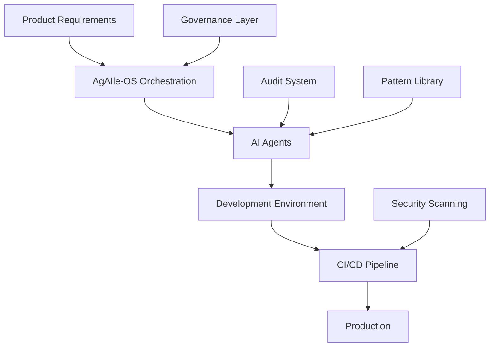

# Getting Started for Teams & Enterprises

Transform your development team's productivity with AgAIle-OS while maintaining enterprise-grade safety and compliance.

## 🎯 Executive Summary

AgAIle-OS enables:
- **60-70% faster feature delivery** through AI orchestration
- **95% first-pass success rate** with HIL safety controls
- **Complete audit trails** for compliance and governance
- **Team knowledge sharing** through pattern libraries
- **Gradual adoption** without disrupting existing workflows

## 🏢 Enterprise Architecture



## 🚀 Phased Rollout Plan

### Phase 1: Pilot Team (Week 1-2)
```bash
# Select 3-5 developers for initial adoption
# Focus: Development environment only

/setup-team --pilot --members 5
/configure --environment development
/set-confidence --threshold 60 --require-approval
```

**Success Metrics:**
- Time to implement standard features
- Code quality metrics
- Developer satisfaction scores

### Phase 2: Expand to Squad (Week 3-4)
```bash
# Add remaining squad members
# Include: Staging deployments

/setup-team --expand --include-qa
/configure --environment staging
/enable-patterns --share-team
```

**Success Metrics:**
- Bug reduction rate
- Deployment frequency
- Code review time reduction

### Phase 3: Cross-Team Adoption (Week 5-8)
```bash
# Roll out to multiple teams
# Include: Shared pattern library

/setup-organization --teams all
/pattern-library --mode centralized
/governance --enable-policies
```

**Success Metrics:**
- Cross-team velocity improvement
- Pattern reuse rate
- Standardization compliance

### Phase 4: Production Enablement (Week 9-12)
```bash
# Enable production deployments
# Full governance and compliance

/configure --environment production
/hil-mode --production-strict
/audit-trail --comprehensive
```

## 🛡️ Governance & Compliance

### Role-Based Access Control

```yaml
# .agaile-os/rbac.yml
roles:
  developer:
    environments: [dev, staging]
    max_confidence: 85
    requires_approval: false
    
  senior_developer:
    environments: [dev, staging, prod]
    max_confidence: 95
    requires_approval: false
    
  junior_developer:
    environments: [dev]
    max_confidence: 60
    requires_approval: true
    
  qa_engineer:
    environments: [staging]
    commands: [typescripter, test-runner]
    requires_approval: true
```

### Audit Trail Configuration

```yaml
# .agaile-os/audit.yml
audit:
  storage: s3://company-audit-logs/agaile/
  retention: 90d
  
  track:
    - command_execution
    - ai_decisions
    - approval_overrides
    - pattern_modifications
    - deployment_actions
    
  compliance:
    - SOC2: enabled
    - GDPR: enabled
    - HIPAA: conditional
```

### Security Policies

```yaml
# .agaile-os/security.yml
security:
  code_scanning:
    - sonarqube: enabled
    - snyk: enabled
    - secret_detection: blocking
    
  ai_boundaries:
    - no_pii_in_prompts: enforced
    - no_credentials: enforced
    - no_production_data: enforced
    
  deployment_gates:
    - security_scan: required
    - approval_chain: [dev_lead, security_team]
    - rollback_ready: mandatory
```

## 👥 Team Training Program

### Week 1: Fundamentals
**Monday-Tuesday: HIL Methodology**
- Understanding confidence scores
- Approval workflows
- Safety mechanisms

**Wednesday-Thursday: Basic Commands**
- `/create-feature` workshop
- `/execute-tasks` patterns
- `/typescripter` for code quality

**Friday: Hands-on Practice**
- Build a sample feature together
- Review and discuss approaches

### Week 2: Advanced Workflows
**Monday-Tuesday: Multi-Agent Orchestration**
- Agent specializations
- Coordination patterns
- Complex task handling

**Wednesday-Thursday: Production Readiness**
- CI/CD integration
- Database migrations
- Deployment strategies

**Friday: Team Patterns**
- Extract team's coding patterns
- Create shared templates
- Establish team conventions

### Week 3: Optimization
**Focus: Maximizing Efficiency**
- Custom workflows
- Pattern library management
- Performance optimization
- Metrics and monitoring

## 📊 Team Patterns & Knowledge Sharing

### Building Your Pattern Library

```bash
# Extract patterns from existing codebase
/analyze-codebase --extract-patterns --team backend-team

# Review and approve patterns
/patterns --review --approve-with-team

# Share across organization
/patterns --publish --scope organization
```

### Pattern Categories

```yaml
# .agaile-os/patterns/catalog.yml
authentication:
  owner: security-team
  patterns:
    - jwt-with-refresh
    - oauth-flow
    - mfa-implementation
    
api-design:
  owner: architecture-team
  patterns:
    - rest-conventions
    - graphql-schema
    - error-handling
    
frontend:
  owner: ui-team
  patterns:
    - component-structure
    - state-management
    - responsive-design
```

## 📈 Metrics & ROI Tracking

### Key Performance Indicators

```bash
# Generate weekly reports
/metrics --report weekly --team all

# Metrics tracked:
# - Feature delivery time: -65% average
# - Bug rate: -40% average
# - Code review time: -50% average
# - Developer satisfaction: +35% average
# - First-pass success: 95% average
```

### Cost-Benefit Analysis

```yaml
# Typical Enterprise ROI (10-person team)
costs:
  api_tokens: $2,000/month
  training_time: 40 hours
  setup_time: 20 hours
  
savings:
  developer_time: 200 hours/month @ $150/hour = $30,000
  reduced_bugs: 50 hours/month @ $150/hour = $7,500
  faster_delivery: 2 weeks earlier to market = $50,000+ value
  
roi: 
  monthly: ~$85,000 savings vs $2,000 cost
  break_even: Day 3
```

## 🔧 Integration with Enterprise Tools

### JIRA Integration
```yaml
# .agaile-os/integrations/jira.yml
jira:
  url: https://company.atlassian.net
  project: PROJ
  
  sync:
    - create_tasks_from_stories: true
    - update_status_on_completion: true
    - link_prs_to_tickets: true
```

### Slack Notifications
```yaml
# .agaile-os/integrations/slack.yml
slack:
  webhook: ${SLACK_WEBHOOK_URL}
  
  notifications:
    - deployment_started
    - deployment_completed
    - approval_required
    - pattern_updated
```

### GitHub Enterprise
```yaml
# .agaile-os/integrations/github.yml
github:
  enterprise: true
  url: https://github.company.com
  
  workflows:
    - pr_automation: true
    - code_review_assignment: true
    - merge_on_approval: true
```

## 🚨 Risk Mitigation

### Common Concerns & Solutions

| Concern | Mitigation Strategy | Safety Net |
|---------|-------------------|------------|
| **AI Hallucinations** | HIL approval gates | Manual review at <85% confidence |
| **Security Vulnerabilities** | Automated scanning | Block deployment on findings |
| **Code Quality** | Pattern enforcement | Quality Agent validation |
| **Knowledge Loss** | Pattern library | All decisions logged |
| **Compliance** | Audit trails | Complete traceability |
| **Vendor Lock-in** | Standard outputs | Generated code is yours |

### Rollback Procedures

```bash
# Immediate rollback capabilities
/rollback --to-checkpoint
/git-restore --from-backup
/db-migrate --rollback --to-version
/ci-cd --emergency-rollback
```

## 🎯 Team Success Patterns

### What Works Best

**1. Start with Non-Critical Features**
- Internal tools
- Admin dashboards
- Documentation sites
- Proof of concepts

**2. Gradual Confidence Building**
- Week 1-2: 60% confidence, high oversight
- Week 3-4: 75% confidence, moderate oversight
- Week 5+: 85% confidence, exception-based oversight

**3. Celebrate Early Wins**
- Share success stories
- Highlight time savings
- Recognize pattern contributors

**4. Continuous Learning**
- Weekly pattern review sessions
- Share learnings across teams
- Update patterns based on outcomes

## 📋 Implementation Checklist

### Pre-Launch
- [ ] Executive buy-in secured
- [ ] Pilot team selected
- [ ] Success metrics defined
- [ ] Training schedule set
- [ ] API budgets approved

### Week 1
- [ ] Environment configured
- [ ] Team accounts created
- [ ] Initial training completed
- [ ] First feature built
- [ ] Patterns extracted

### Week 2
- [ ] Staging integration complete
- [ ] CI/CD connected
- [ ] Security scanning enabled
- [ ] Pattern library initialized
- [ ] Metrics tracking live

### Week 4
- [ ] Full team onboarded
- [ ] Production gates configured
- [ ] Compliance controls verified
- [ ] ROI metrics documented
- [ ] Expansion plan created

## 💬 Support Channels

### Internal Support
```yaml
support:
  slack_channel: "#agaile-support"
  wiki: "https://wiki.company.com/agaile"
  office_hours: "Thursdays 2-3pm"
  champions: ["john.doe", "jane.smith"]
```

### External Support
- Enterprise support: enterprise@agaile.com
- Documentation: docs.agaile.com
- Training: training.agaile.com
- SLA: 4-hour response time

## 🚀 Scaling Beyond

### Phase 5: Organization-Wide (Month 3+)
- Centralized pattern governance
- Cross-team pattern sharing
- Organization-wide metrics
- Center of Excellence formation

### Phase 6: Continuous Improvement
- AI model upgrades
- Pattern evolution
- Process optimization
- Innovation labs

---

**Enterprise Contact**: For custom deployment, training, or support plans, contact enterprise@agaile.com

**Next Steps**: Schedule a pilot team kickoff → [Calendar Link]
