# AgAIle-OS: The Evolution of Agile for the AI Era

> **AgAIle = Agile + AI** - Reimagining software development methodology where humans and AI collaborate in perfect harmony

## 🎬 What This Actually Does

**Watch AI build a complete SaaS app in 60 seconds:**

```bash
/create-feature "Build a task management app with:
  - User authentication with social login
  - Team workspaces with role-based access
  - Real-time collaboration
  - Stripe subscription billing"
```

> **This isn't code - it's the instructions that make AI write code for you.**

## 🚀 Quick Start - Choose Your Path

### 🎨 **For Designers & No-Coders** (5 min setup)
```bash
1. Install Cursor (free)
2. Copy this repo to your project
3. Type: /create-feature "modern landing page with pricing cards"
4. Watch AI build everything
```
[→ Detailed Designer Guide](.agaile-os/docs/getting-started/for-designers.md)

### 💻 **For Developers** (2 min setup)
```bash
git clone https://github.com/Agaile-com/agaile-os-template .agaile-os
./agaile-os/setup/install.sh
/typescripter --analyze  # See what AgAIle can do
```
[→ Developer Documentation](.agaile-os/docs/getting-started/for-developers.md)

### 🏢 **For Teams & Enterprises**
- HIL methodology training for safe automation
- Custom confidence thresholds per environment
- Production safety protocols with audit trails

[→ Enterprise Setup](.agaile-os/docs/getting-started/for-teams.md)

## 📊 Real Results

| What We Built | Time | Lines of Code | Human Input | Traditional Time |
|--------------|------|---------------|-------------|-----------------|
| **SaaS Dashboard** | 3 hours | 12,000 | 15 prompts | 2-3 weeks |
| **E-commerce Site** | 5 hours | 18,000 | 22 prompts | 3-4 weeks |
| **API + Auth** | 2 hours | 8,000 | 10 prompts | 1-2 weeks |
| **Mobile App** | 4 hours | 15,000 | 18 prompts | 3-4 weeks |

## 🎯 Try Before You Install

### Copy & Paste These Into Claude/Cursor:

<details>
<summary><b>Example 1: Modern Landing Page</b></summary>

```prompt
/create-feature "SaaS landing page with:
  - Animated hero section with gradient mesh
  - Feature cards with hover animations
  - Pricing toggle (monthly/yearly)
  - Email capture with Mailchimp
  - Testimonials carousel
  - Dark mode support"
```
</details>

<details>
<summary><b>Example 2: Complete Authentication</b></summary>

```prompt
/create-feature "User authentication system:
  - Email/password signup
  - Google & GitHub OAuth
  - Magic link authentication
  - 2FA with TOTP
  - Password reset flow
  - Session management"
```
</details>

<details>
<summary><b>Example 3: Stripe Integration</b></summary>

```prompt
/create-feature "Stripe subscription billing:
  - Multiple pricing tiers
  - Customer portal access
  - Webhook handling
  - Usage-based billing
  - Invoice generation
  - Dunning management"
```
</details>

## 🧠 How It Works - AgAIle Sprints with HIL (Human-in-the-Loop)

### **AgAIle = Agile + AI** 🚀
The evolution of Agile methodology for the AI era

```mermaid
graph LR
    A[Phase 1: Discovery] -->|Human: Decides WHAT| B[Phase 2: Planning]
    B -->|Human: Approves| C[Phase 3: Development]
    C -->|AI: Executes| D[Phase 4: Quality Gates]
    D -->|Human: Reviews| E[Phase 5: CI]
    E --> F[Phase 6: Staging]
    F -->|Human: Validates| G[Phase 7: Production]
    G -->|Human: Approves| H[Phase 8: Operations]
    H -->|Feedback| A
    
    style A fill:#e1f5fe
    style B fill:#e1f5fe
    style D fill:#e1f5fe
    style F fill:#e1f5fe
    style G fill:#fff3e0
```



**🔄 AgAIle Sprint Cycles (not waterfall!)**
This is Agile methodology reimagined with AI:
- Humans make strategic decisions
- AI handles implementation
- Humans validate critical points
- Everything happens in parallel within sprints

### The HIL Approach - Where Humans Stay in Control:

| Phase | Human Decides | AI Executes | Safety Gate |
|-------|--------------|------------|-------------|
| **Discovery** | What to build | How to architect | Business requirements |
| **Planning** | Sprint scope | Task breakdown | Priority & estimates |
| **Development** | Business logic | Code implementation | Security review |
| **Quality** | Accept/reject | Fix issues | Code review required |
| **Staging** | UAT approval | Deployment process | Performance metrics |
| **Production** | Go/no-go | Deployment execution | Manual approval required |
| **Operations** | Incident response | Monitoring & patches | Critical issues escalated |

## 🛡️ HIL (Human-in-the-Loop) Safety

**AgAIle uses confidence-based automation:**

```yaml
HIGH (85-100%): Auto-executes with logging
MEDIUM (60-84%): Asks for your approval
LOW (30-59%): Shows options, you decide
CRITICAL (<30%): Human only - AI assists
```

**You're always in control:**
- Start with analysis mode - see what AI would do
- Graduate to approval mode - confirm each action
- Move to auto mode - for trusted operations
- Emergency stop - CTRL+C anytime

## 💰 What You'll Need

### Minimum (No-Code Path)
- ✅ Cursor IDE (free tier works)
- ✅ Claude API key ($5 minimum)
- ✅ 30 minutes to learn

### Recommended (Developer Path)
- ✅ Everything above +
- ✅ Git basics
- ✅ MCP server (optional)
- ✅ Your favorite stack

### Cost Estimate
- 🏗️ **MVP**: ~$20-50 in API tokens
- 🚀 **Full App**: ~$100-200 in API tokens
- 💡 **Tip**: Use Claude Opus for complex logic, Sonnet for routine tasks

## 🤔 Common Concerns

<details>
<summary><b>"Will AI mess up my code?"</b></summary>

HIL methodology means nothing executes without your approval. Start with low confidence thresholds and increase as you build trust. Every action is logged and reversible.
</details>

<details>
<summary><b>"What if I don't know how to code?"</b></summary>

Perfect! The AI handles the coding. You just describe what you want in plain English. Our no-code path is designed specifically for designers and entrepreneurs.
</details>

<details>
<summary><b>"Is this production-ready?"</b></summary>

Yes. AgAIle includes production safety protocols, comprehensive testing, and deployment pipelines. Major apps are running on code generated by this system.
</details>

<details>
<summary><b>"How is this different from Copilot?"</b></summary>

Copilot helps write code line-by-line. AgAIle orchestrates entire features, handles databases, deployments, and documentation. It's a team vs. a typist.
</details>

## ⚡ Core Commands

| Command | What It Does | Example |
|---------|-------------|---------|
| `/create-feature` | Build complete features | `/create-feature "user dashboard with charts"` |
| `/execute-tasks` | Run development tasks | `/execute-tasks --auto` |
| `/db-migrate` | Handle database changes | `/db-migrate --sync` |
| `/typescripter` | Fix TypeScript errors | `/typescripter --auto-fix` |
| `/ci-cd` | Deploy to production | `/ci-cd --deploy prod` |

[→ Full Command Reference](.agaile-os/docs/commands-reference.md)

## 📁 What's in the Box

```
your-project/
├── .agaile-os/              # 🧠 The AgAIle brain
│   ├── commands/            # Slash commands for AI
│   ├── agents/              # Specialized AI personalities  
│   ├── docs/                # Deep-dive documentation
│   ├── templates/           # Feature templates
│   └── MASTER_TRACKING.md   # Your project command center
├── .claude/                 # Claude-specific config
├── .cursor/                 # Cursor-specific config
└── [your code]              # What AI builds for you
```

## 🎯 Reality Check

### ✅ What AgAIle WILL Do:
- Generate 80% of your code automatically
- Handle all routine development tasks
- Maintain consistent code quality
- Set up CI/CD pipelines
- Write comprehensive documentation

### ❌ What AgAIle WON'T Do:
- Replace understanding your product
- Make business decisions for you
- Work without API tokens
- Debug complex business logic alone
- Deploy without your approval

## 🚦 Getting Started

### First-Timer? Run This:
```bash
/agaile-setup

# This wizard will:
# 1. Detect your experience level
# 2. Set appropriate safety thresholds
# 3. Create your first project
# 4. Walk through building your first feature
```

### Ready to Build?
```bash
# 1. Describe your product vision
/plan-product "I want to build..."

# 2. Create your first feature
/create-feature "Start with..."

# 3. Let AI build it
/execute-tasks --guided

# 4. Deploy when ready
/ci-cd --deploy staging
```

## 📚 Learn More

- 🚀 [**AgAIle: The Evolution of Agile**](.agaile-os/docs/AgAIle-methodology-evolution.md) - Why Agile + AI = AgAIle
- 📖 [HIL Methodology Deep Dive](.agaile-os/docs/HIL-development-methodology.md)
- 🔧 [MCP Integration Guide](.agaile-os/docs/MCP-Setup.md)
- 🎓 [Video Tutorials](https://github.com/Agaile-com/agaile-os-template#tutorials)
- 💬 [Community Discord](https://github.com/Agaile-com/agaile-os-template#community)

## 🤝 Support

- 🐛 [Report Issues](https://github.com/Agaile-com/agaile-os-template/issues)
- 💡 [Request Features](https://github.com/Agaile-com/agaile-os-template/discussions)
- ⭐ [Star Us](https://github.com/Agaile-com/agaile-os-template) if this helps!

---

<div align="center">

**AgAIle-OS v1.0** - The Evolution of Agile for the AI Era

***AgAIle = Agile + AI*** | Build 10x Faster, Ship with Confidence

[Website](https://agaile.com) • [Docs](https://docs.agaile.com) • [Blog](https://blog.agaile.com)

</div>
